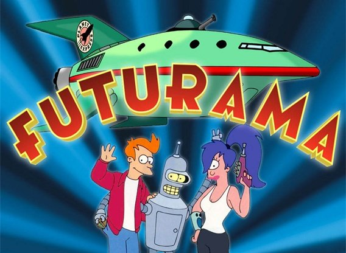

***INSERT GRAPHIC HERE (include hyperlink in image)***

# Futurama Gif Search

> This project generates GIFs when buttons named after Futurama characters are clicked. The user can also generate their own GIFs.

> *Futurama, GIPHY, GIF-GENERATOR*

- API search still has to be optimized.
- 

   

